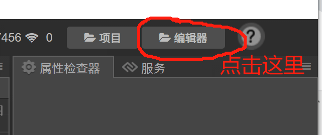
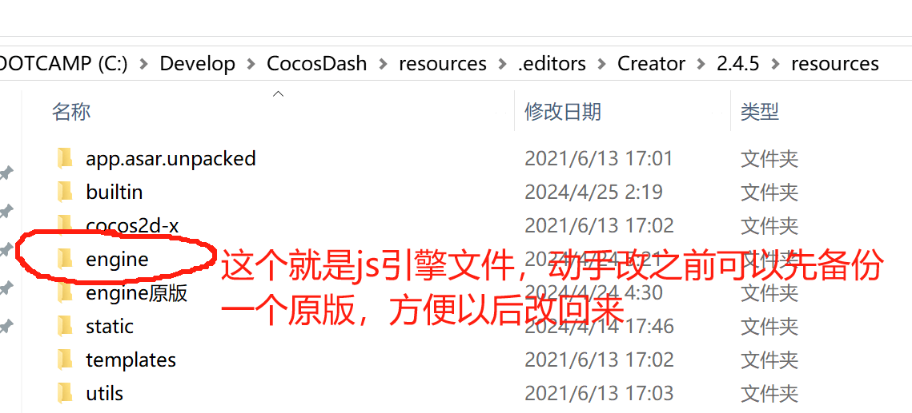
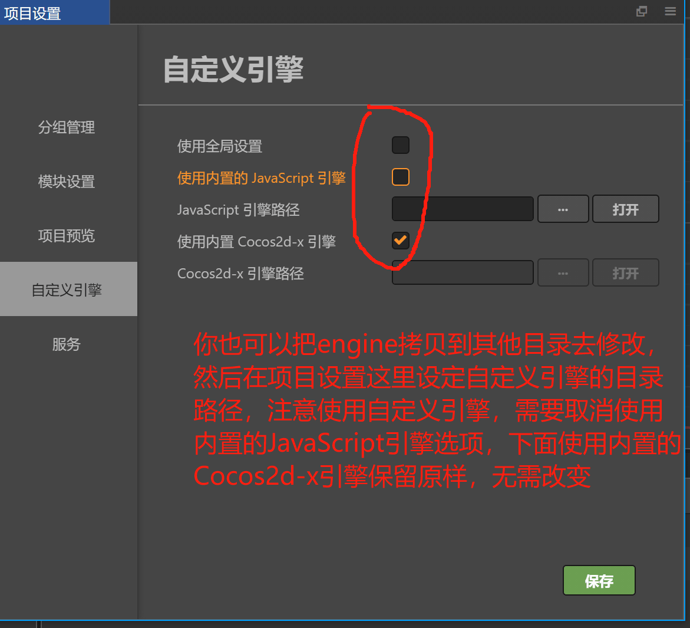
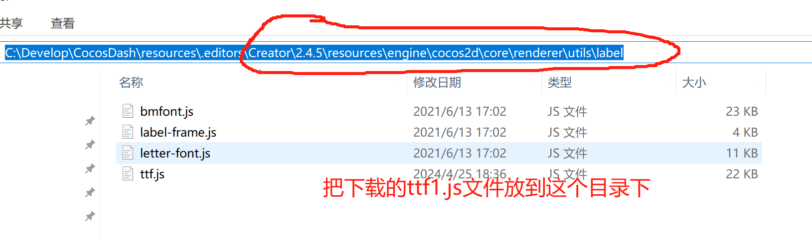
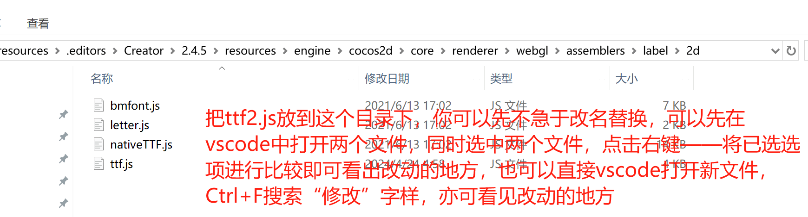
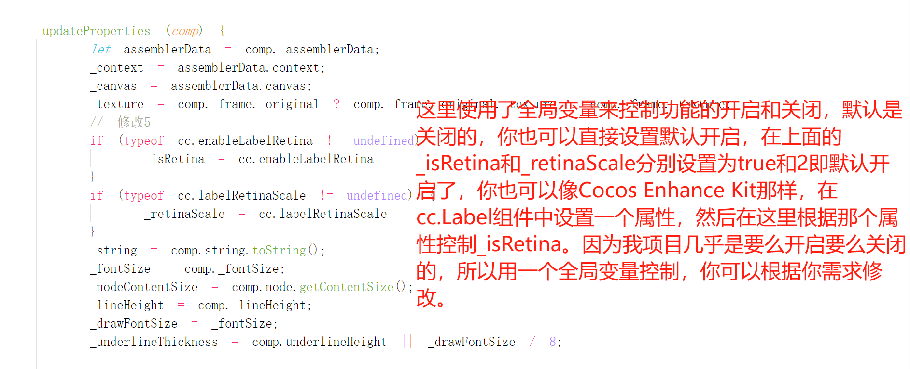
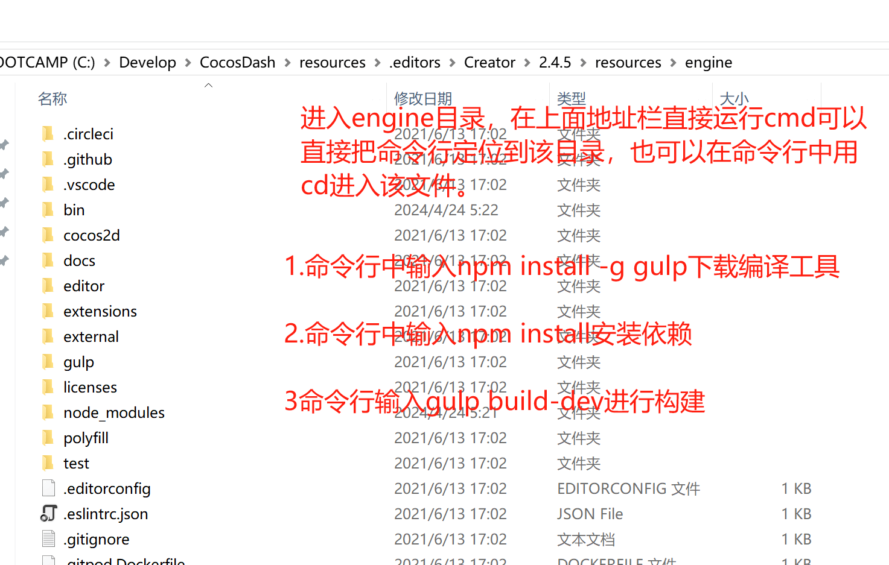
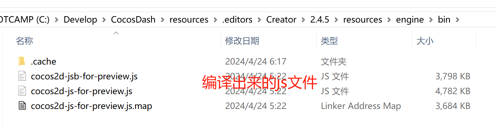

# <转载>Cocos Creator2.4版本文字模糊终极解决方案

感谢原作者：论坛地址：https://forum.cocos.org/t/topic/157603

前言：相信你也会发现，Cocos Creator的文字组件在高清分辨率屏幕下，会表现得非常模糊，相比原生界面的文字，差别很大。开始的时候，我没有注意到这个问题，因为我没有想到，文字组件作为最基本的组件，这么大一个引擎，竟然会有这个问题。后来随着项目的“壮大”，才发现这个问题。然后搜了很多解决方法，最多的一个方法就是字体大小* 2，行高* 2，节点大小* 2，Scale/2的方法。但是对于已经存在的项目，且使用文本较多的时候，逐个去修改文字的属性，简直就是一场噩梦！哪怕写成一个组件，逐个去挂载也是极为繁琐的事情，并且节点大小的改变，有些布局排版也会受到影响。后来搜索到了Cocos Enhance Kit

> 引用Cocos Enhance Kit [https://forum.cocos.org/t/topic/137649 38](https://forum.cocos.org/t/topic/137649)

这里面的文字高清功能可以完美解决文字模糊的问题，但是由于该kit的功能较多，并且要编译原生引擎，由于里面大多功能我没有用到，并且可能由于我的环境问题，总是没有编译成功。所以决定单独抽取其文字高清的功能，经过几个晚上的研究，粗略地了解了一下原理：就是从引擎渲染文字的层面对文字进行放大缩放，这样不需要在编辑器改变节点的宽高Scale等属性。

因为涉及到修改引擎，所以你可能还需要了解这些知识：
[https://docs.cocos.com/creator/2.4/manual/zh/advanced-topics/engine-customization.html 22](https://docs.cocos.com/creator/2.4/manual/zh/advanced-topics/engine-customization.html)

只需要修改引擎两个关于文字渲染的文件即可。
第一步：

然后进入到引擎的目录

你也可以直接拷贝engine目录到其他地方，然后修改，再在项目设置里面设置自定义js引擎的路径，这里仅仅是修改了js引擎，不用修改cocos2dx原生引擎，即可工作。

下载好需要改变的这两个文件,因为我的机器上面只装有2.45版本和2.49版本，所以只改了这两个版本的文件，如果你使用其他的版本，可以照着修改。

[ttf修改文件.zip](https://forum.cocos.org/uploads/short-url/ddJEm0GCRPHkLCIACZcobuiYyA1.zip) (14.3 KB)

里面分别包含了2.45和2.49两个版本对应的两个文件，请根据你的Cocos Creator选择对应的版本，如果你的版本不是这两个版本，可以参考源码对应修改，可以用vsCode打开，Ctrl+F搜索关键字“修改”，里面需要改动的几个地方会有注释。对照着改即可。

下载好文件之后，把ttf1.js文件和ttf2.js分别放到引擎目录的Creator\2.4.5\resources\engine\cocos2d\core\renderer\utils\label
和：
Creator\2.4.5\resources\engine\cocos2d\core\renderer\webgl\assemblers\label\2d

替换之后记得改回ttf.js名字啊，别傻乎乎地就留着ttf1.js的名字。

如图所述，使用了一个全局变量来控制文字高清开启和关闭，也可以在cc.Label中增加一个属性来为单独的文字组件提供开启和关闭。具体参考Cocos Enhance Kit的代码，因为文字高清基本是全局开的，所以我就没搞这个功能了，全局开即可。

然后在项目初始化入口之前设置一下全局变量即可。
cc.enableLabelRetina = true;
cc.labelRetinaScale = 2;

至此就完成了修改引擎的工作，当你修改完之后，你重新运行，你会发现没有什么变化，这是因为，js引擎没有编译。所以改完之后你需要编译一下，你可以理解为把那么多的js文件编译成一个js文件或者进行min压缩等操作，以便于发行或在浏览器中运行。

编译你可以参考上面关于自定义引擎相关的连接

编译步骤：
1.首先你得安装了nodejs和npm，一般你下载nodejs安装配套都有npm的。默认安装应该都会自动添加到环境变量的，你随便在一个文件打开cmd命令，输入node -v 和npm -v 如果都输出有对应的版本号，证明nodejs环境安装好了，如果没有，则检查一下node的环境变量

2.去到引擎文件执行编译工具安装和编译等命令

如图，分别上面三步命令，
1： npm install -g gulp
2：npm install
3：gulp build-dev

第三步完成之后你会在你的engine目录下存在一个bin文件，可能之前就有，但是编译之前也不用删，它会覆盖的。进入文件你可以看到编译出来的相关js文件了。

然后重启你的Cocos Creator，需要重启才生效，并且你项目设置了
cc.enableLabelRetina = true;
cc.labelRetinaScale = 2;

那么就可以看到效果了。准备亮瞎你的钛合金眼吧！体验一下一劳永逸的感觉，这一刻你会发现世界多么美好。
感谢Cocos Enhance Kit！

另外，bmFont也是可以改为高清的，因为我项目没有用到，所以没去研究，可以参考上面Cocos Enhance Kit！，下载相关引擎代码，去参考engine\cocos2d\core\renderer\utils\label\bmfont.js这个文件即可。

其他版本的也可以照着原理改，3.几版本的因为没有安装和研究过，不知道内置引擎是否已经自动添加高清的支持。

这里看着好像步骤很多，其实就是换两个文件，重新编译。写得详细点，毕竟每个开发者都喜欢保姆级的教程。

## 总结

我是在原作者的基础上 新增了 2.4.13 版本