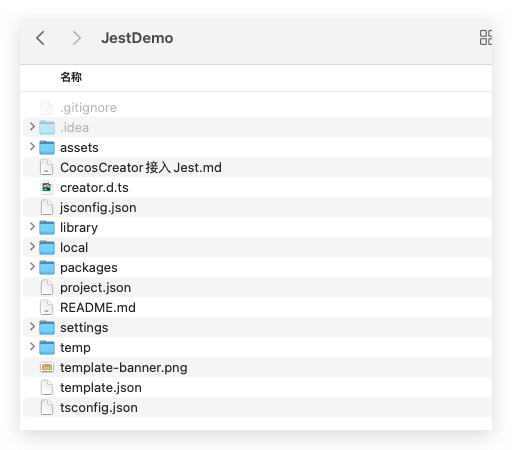
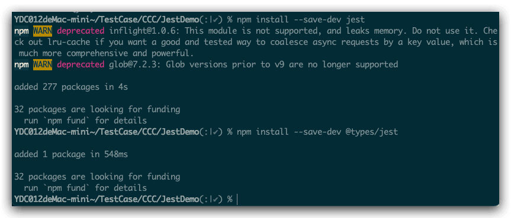
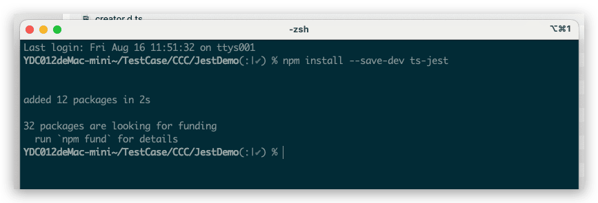
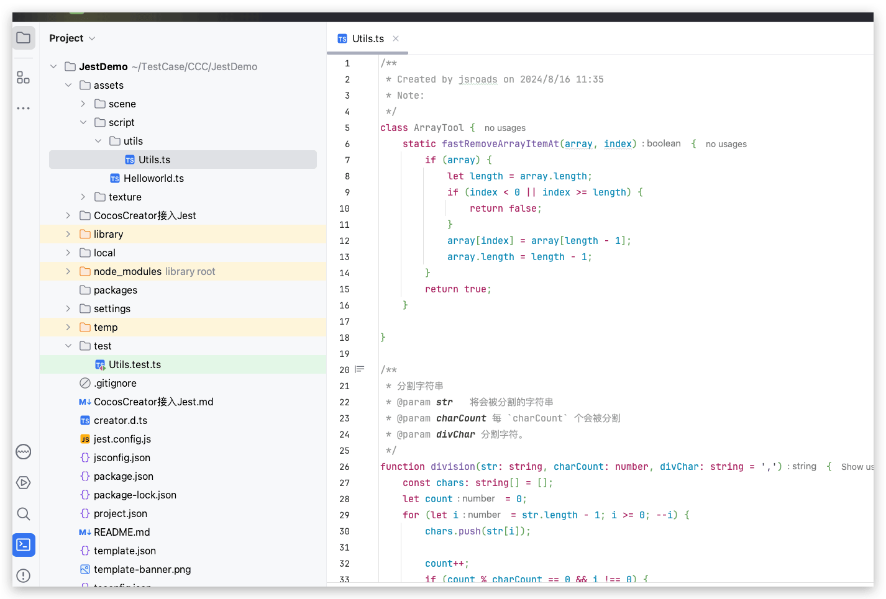
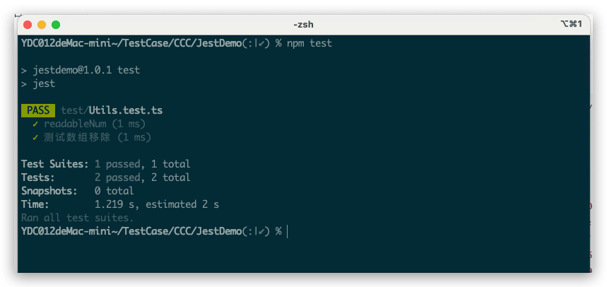

# CocosCreator接入Jest

## 介绍

Jest 是一个令人愉快的 JavaScript 测试框架，旨在确保任何 JavaScript 代码的正确性。它为你提供了。它为你提供了 易于理解、熟悉且功能丰富的 API 来编写测试用例专注于 简洁明快。这些项目都在使用 Jest：[Babel](https://babeljs.io/)、 [TypeScript](https://www.typescriptlang.org/)、 [Node](https://nodejs.org/)、 [React](https://reactjs.org/)、 [Angular](https://angular.io/)、 [Vue](https://vuejs.org/) 等等


中文官网地址：https://www.jestjs.cn/

## 环境

- Cocos Creator2.4.13
- Mac
- Node.js 16.20

## 新建测试项目

#### 新建项目



## Jest接入流程

### 初始化nodejs项目

1. **Jest基于nodejs**，所以第一步是将我们的项目初始化成`nodejs`项目。在项目根目录下，命令行运行指令 `npm init` 即可。


### 安装Jest

2. 运行命令行指令：

```bash
npm install --save-dev jest
npm install --save-dev @types/jest
```



备注：其中第一行为`Jest`本体，第二行是在我们写单元测试时，提供代码提示的声明文件（`.d.ts`文件）工具。

3. 如果是ts工程，继续安装 `ts-jest` 我们是`Typescript`项目

```
 npm install --save-dev ts-jest
```



4. 修改nodejs默认的测试指令。// package.json文件

```json
// package.json
{
  "scripts": {
    "test": "jest"
  },
}
```

5. 测试效果：改完测试一下是否配置成功，运行命令行 `npm test`


得到提示“ **No tests found, exiting with code 1** ”，即为安装成功。

6. 上面命令运行后Jest提示，没有找到测试用例，这就来写一个简单的例子！

- 先在我们的项目下写一个工具函数 比如 Utils.ts
- 在根目录和assets 目录平级 这里起名字叫test
- 然后在 test目录下新建一个js文件叫做 Utils.test.ts




7. 编写我们的`Utils.ts`文件内容

```typescript
/**
 * Created by jsroads on 2024/8/16 11:35
 * Note:
 */
export class ArrayTool {
    static fastRemoveArrayItemAt(array, index) {
        if (array) {
            let length = array.length;
            if (index < 0 || index >= length) {
                return false;
            }
            array[index] = array[length - 1];
            array.length = length - 1;
        }
        return true;
    }

}

/**
 * 分割字符串
 * @param str   将会被分割的字符串
 * @param charCount 每 `charCount` 个会被分割
 * @param divChar 分割字符。
 */
function division(str: string, charCount: number, divChar: string = ',') {
    const chars: string[] = [];
    let count = 0;
    for (let i = str.length - 1; i >= 0; --i) {
        chars.push(str[i]);

        count++;
        if (count % charCount == 0 && i !== 0) {
            chars.push(divChar);
        }
    }

    const result = chars.reverse().join('');
    return result;
}


/**
 * 使数字可读。如：1004213 -> '1,004,213'
 * @param number
 * @param divChar 分割字条符
 */
export function readableNum(number: number, divChar = ',') {
    if (String(number).length <= 3) {
        return String(number);
    }

    if (number < 0) {
        return '-' + division(String(-1 * number), 3, divChar);
    }

    return division(String(number), 3, divChar);
}
```

8. 新建一个`jest.config.js`文件  一些jest的配置，让它去哪个目录找测试文件。在根目录下新建：`./jest.config.js`文件

```javascript
module.exports = {
    preset: "ts-jest",         // 如果是 js 工程，则是 "jest"
    collectCoverageFrom: ['<rootDir>/assets/**/*.ts'],
    testEnvironment: 'node',   // 测试代码所运行的环境
    // verbose: true,          // 是否需要在测试时输出详细的测试情况
    rootDir: "./test",         // 测试文件所在的目录
    globals: {                 // 全局属性。如果你的被测试的代码中有使用、定义全局变量，那你应该在这里定义全局属性
        window: {},
        cc: {}
    }
};
```

9. 编写我们的测试文件 `Utils.ts`

```typescript
import { ArrayTool, readableNum } from "../assets/script/utils/Utils";

test('readableNum', () => {
    expect(readableNum(1000)).toBe('1,000');
    expect(readableNum(10000)).toBe('10,000');
    expect(readableNum(416506250)).toBe('416,506,250');
    expect(readableNum(416506250, '.')).toBe('416.506.250');
    expect(readableNum(416506250, '')).toBe('416506250');
    expect(readableNum(-600 * 1000, '.')).toBe('-600.000');
    expect(readableNum(-600 * 1000 * 1000, '.')).toBe('-600.000.000');
    expect(readableNum(-121892262728, '.')).toBe('-121.892.262.728');
    expect(readableNum(0)).toBe('0');
});


test("测试数组移除", () => {
    expect(ArrayTool.fastRemoveArrayItemAt([1,2,3], 0)).toBe(true);
    expect(ArrayTool.fastRemoveArrayItemAt([1,2,3], 4)).toBe(false);
    expect(ArrayTool.fastRemoveArrayItemAt([1,2,3], -1)).toBe(false);
});
```

 基于 `jest` 文档说明，上面测试简单说明一下：

- `test` 方法开启一个单元测试

  - 第 1 个参数是名字

  - 第 2 个参数是测试的内容。

- `expect` 方法参数中传入被测试的内容

- `toBe` 是期望的结果。这里只是简单做的示范

`jest` 远比这里展示的丰富。

## 测试Jest

我们在根目录下运行  `npm test`



## 参考

- [Jest单元测试框架接入及兼容Cocos方案实现](https://forum.cocos.org/t/topic/139862)
- [CocosCreator 中单元测试入门](https://forum.cocos.org/t/cocoscreator/95482)
- https://slides.com/mangogan/jestxccc/fullscreen
- https://github.com/mangogan-git/jest_totuiral