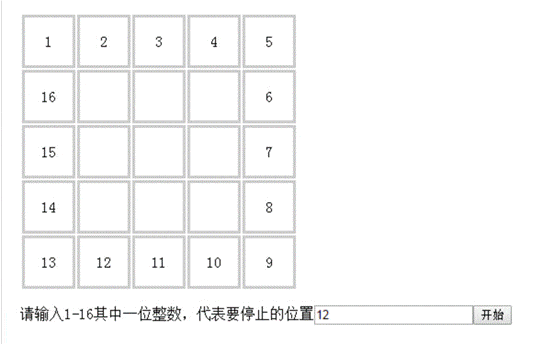

# Cocoscreator 工程测试题目：

 

用Cocoscreator 实现一个简单的转盘抽奖页面。如下图：

 

 

 

 要求。转盘启动后 每个数字依次顺时针被点亮为红色， 速度从每秒点亮20个数字（设定最高频率为20个/秒），持续1-3秒，逐步（中间频率自定义，每个频率的持续时间都是1-3秒之间，总频率数不得少于5个频率）降低到每秒点亮2个数字，并等待2秒后，落到最终设定的停止的位置的数字上，并显示为绿色。 转盘停止转动时 所有格子内的数字都要同时变成100。

每次启动转盘都从数字1开始，。

要求：

Cocoscreator 任意版本均可，

交付最终的所有工程项目文件。

## 解决方案

- CocosCreator3.7.2