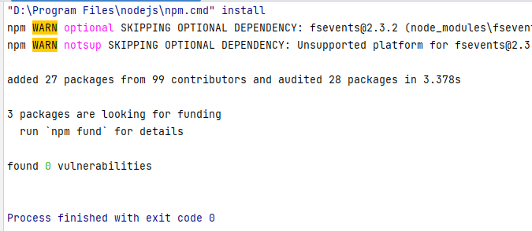

# 使用说明

## 初始化项目

项目下载后，首先再项目内运行

```
npm install
```

运行如下:



成功后 多出一个目录  node_modules

## 编译项目

详细内容 参考 https://www.rollupjs.com/

如果没有安装 rollup 需要安装

```
npm install --global rollup
```

在项目根目录 执行 编译

```
# 默认使用rollup.config.js
$ rollup --config

# 或者, 使用自定义的配置文件，这里使用my.config.js作为配置文件
$ rollup --config my.config.js
```


生成类库

